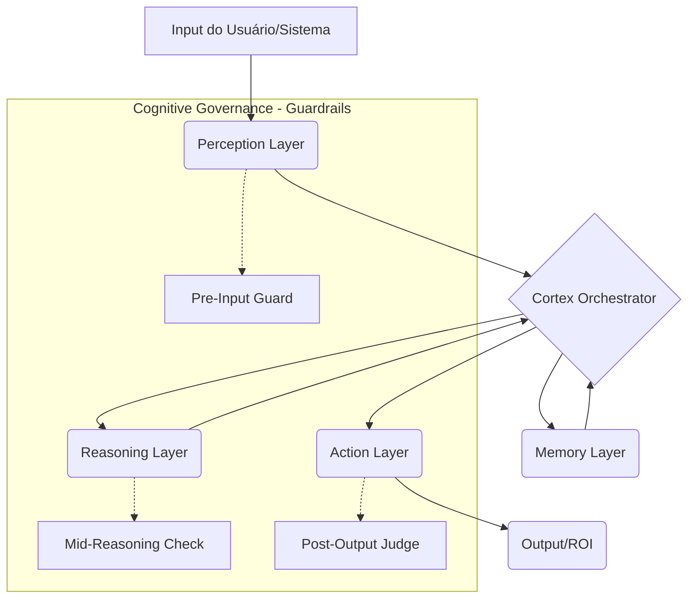

# 🍕 Pentagon Pizza: Arquitetura de Consciência Operacional Órion

## 🏗️ Visão Geral
A arquitetura **Pentagon Pizza** é um framework de consciência operacional projetado para maximizar o ROI em aplicações jurídicas, utilizando uma abordagem modular ("fatias") inspirada em arquiteturas cognitivas clássicas (ACT-R) e sistemas modernos de governança de IA (NeMo Guardrails).

## 🧩 Os 5 Pilares (Pentagon)

### 🥇 1. Percepção (Input Layer)
**Objetivo:** Transformar dados brutos em representações semânticas processáveis.
- **NLP & Parsing Jurídico:** Extração de entidades, fatos e intenções de petições, e-mails e documentos.
- **Contextual Awareness:** Identificação do estado atual do processo e perfil do cliente.
- **Tecnologias:** LLM-based NER, `nlp-semantic-analyzer.ts`.

### 🥈 2. Memória (Brain Layer)
**Objetivo:** Prover persistência de contexto e conhecimento especializado.
- **Curto Prazo (Sessão):** Histórico imediato da conversa.
- **Longo Prazo (Conhecimento):** Jurisprudência, modelos de petição, histórico de casos.
- **Aprendizado (Episódica):** Feedback de interações passadas para melhoria contínua.
- **Tecnologias:** Supabase Vector (pgvector), `episodic-memory.ts`, `corrective-rag.ts` (CRAG).

### 🥉 3. Raciocínio (Engine Layer)
**Objetivo:** Processamento lógico e geração de estratégias.
- **Modular Reasoning:** Decomposição de tarefas complexas em sub-tarefas.
- **Legal Rules:** Aplicação de heurísticas e normas jurídicas.
- **Tecnologias:** LLM (DeepSeek R1 / GPT-4o), `cognitive-fast-reasoner.ts`.

### 🏅 4. Ação (ROI Layer)
**Objetivo:** Entrega de valor tangível.
- **Task Execution:** Geração de documentos, resumos, cálculos de risco.
- **External Integration:** ClickSign, Stripe, Google Workspace.
- **Tecnologias:** `orion-tool-executor.ts`, `LegalAction` interfaces.

### 🧠 5. Metacognição (Meta Layer)
**Objetivo:** Governança, auto-correção e segurança.
- **Self-Evaluation:** O sistema avalia se a resposta é coerente e fundamentada.
- **Routing:** Escolha otimizada entre modelos (Local vs Cloud).
- **Guardrails:** Pre-Input, Mid-Reasoning e Post-Output checks.
- **Tecnologias:** `rag-consciousness.ts`, `quantum-llm-router.ts`.

## 🔄 Loop Cognitivo (Córtex)
O **Córtex** (evolução do Maestro) orquestra o fluxo em um ciclo fechado:
1. **Perceber:** Captar intenção e contexto.
2. **Recuperar:** Buscar fatos e memórias relevantes.
3. **Raciocinar:** Gerar hipóteses e planos de ação.
4. **Agir:** Executar a tarefa que gera valor.
5. **Avaliar:** Validar o resultado e aprender com o processo.

## 📐 Diagrama de Fluxo (Mermaid)

## 🧪 Inspirações Científicas
- **ACT-R (Atomic Components of Thought-Rational):** Modularidade entre memória declarativa (Memória) e procedural (Raciocínio/Ação).
- **NeMo Guardrails:** Implementação de trilhos de segurança e verificações programáticas em cada etapa do pipeline.

## 🚀 Estratégia de Implementação
1. **Nova Abstração:** Criar `PentagonPizzaOrchestrator.ts`.
2. **Adapters:** Envolver os módulos existentes de `src/lib/neural` em interfaces padronizadas por pilar.
3. **Foco Jurídico:** Priorizar ações que geram economia de tempo e precisão técnica.
